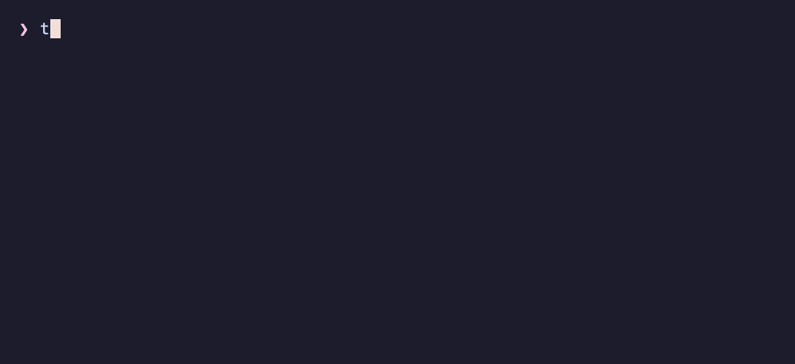

<div align="center">


# timeout

**Run a command with a time limit on macOS.**
A dependency-free Go port of GNU `timeout`, with the same flags and exit codes.

[](https://github.com/4thel00z/timeout/actions/workflows/ci.yml)
[](https://github.com/4thel00z/timeout/releases)
[](go.mod)
[](LICENSE)



</div>

---

macOS doesn't come with `timeout`. You can get it from Homebrew's `coreutils`, but there it is called `gtimeout` and it brings about a hundred other GNU tools with it. This is one static binary. Scripts written for Linux run unchanged.

## Install

**Prebuilt binary** (Apple Silicon, Intel, or universal):

```sh
curl -sSL https://github.com/4thel00z/timeout/releases/latest/download/timeout_darwin_universal.tar.gz \
  | sudo tar -xz -C /usr/local/bin timeout
```

**With Go:**

```sh
go install github.com/4thel00z/timeout@latest
```

**From source:**

```sh
git clone https://github.com/4thel00z/timeout && cd timeout && make install
```

## Usage

```text
timeout [OPTION] DURATION COMMAND [ARG]...
```

```sh
timeout 5 curl https://example.com          # give up after 5 seconds
timeout 2m make test                        # minutes, hours (h) and days (d) work too
timeout 1.5 ./flaky.sh                      # fractions are fine
timeout 250ms ./probe                       # so are Go durations
timeout -s INT 10 ./server                  # send SIGINT instead of SIGTERM
timeout -k 5 30 ./stubborn                  # TERM after 30s, KILL 5s later if still alive
timeout --preserve-status 10 ./job          # report the command's own exit status
timeout -v 3 sleep 10                       # print each signal as it is sent
```

| Option | Description |
| --- | --- |
| `-s`, `--signal SIGNAL` | Signal to send on timeout. Name (`TERM`, `SIGINT`, `kill`) or number. Default `TERM`. |
| `-k`, `--kill-after DUR` | If the command is still running `DUR` after the first signal, send `KILL`. |
| `-v`, `--verbose` | Print every signal sent to stderr. |
| `--preserve-status` | Exit with the command's status even when it timed out. |
| `--foreground` | Leave the command in the foreground process group, so it can read from the TTY. Its child processes are not signalled. |
| `--version` | Print the version. |

`DURATION` is a number with an optional suffix: `s` (default), `m`, `h` or `d`. Go durations such as `1m30s` or `250ms` also work. `0` turns the timeout off.

### Exit status

| Code | Meaning |
| --- | --- |
| `124` | The command timed out and `--preserve-status` was not given. |
| `125` | `timeout` itself failed (bad flag, bad duration, bad signal). |
| `126` | The command exists but could not be run. |
| `127` | The command was not found. |
| `137` | The command was killed with `KILL`. |
| other | The command's own exit status, or `128 + N` if signal `N` terminated it. |

## How it works

`timeout` starts the command in a new process group and signals the whole group, so a shell script and every process it spawned stop together. `SIGINT`, `SIGTERM`, `SIGHUP`, `SIGQUIT`, `SIGUSR1` and `SIGUSR2` sent to `timeout` are passed on to the command. Each timeout signal is followed by `SIGCONT`, so a stopped process still receives it.

Because the command runs in its own process group, an interactive program that reads from the terminal will be stopped by `SIGTTIN`. Use `--foreground` for programs like that.

## Development

The hooks run [lefthook](https://github.com/evilmartians/lefthook), [gofumpt](https://github.com/mvdan/gofumpt) and [golangci-lint](https://golangci-lint.run). All three are single Go binaries, installed at pinned versions with `go install`:

```sh
make tools    # install lefthook, gofumpt and golangci-lint
make hooks    # install the git hooks
make check    # format check + lint + tidy + tests, the same as CI
```

| Target | Description |
| --- | --- |
| `make build` | Build `bin/timeout` |
| `make test` | Run the tests with the race detector |
| `make fmt` / `make lint` | Format / lint |
| `make demo` | Record `assets/demo.gif` with [asciinema](https://asciinema.org) and [agg](https://github.com/asciinema/agg) |
| `make snapshot` | Build a local release with [GoReleaser](https://goreleaser.com) |

Hooks: `pre-commit` formats staged files, lints and checks `go.mod`. `pre-push` runs the tests.

### Releasing

Push a `v*` tag. The release workflow runs GoReleaser, which builds darwin `amd64`, `arm64` and universal binaries, publishes them with checksums, and updates the cask in [4thel00z/homebrew-tap](https://github.com/4thel00z/homebrew-tap).

```sh
git tag v0.1.0 && git push origin v0.1.0
```

## License

[MIT](LICENSE)
